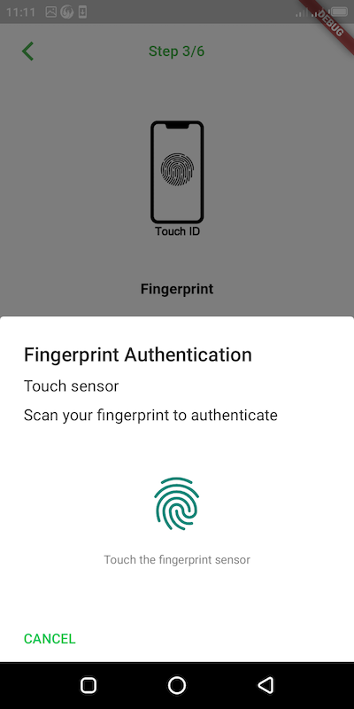
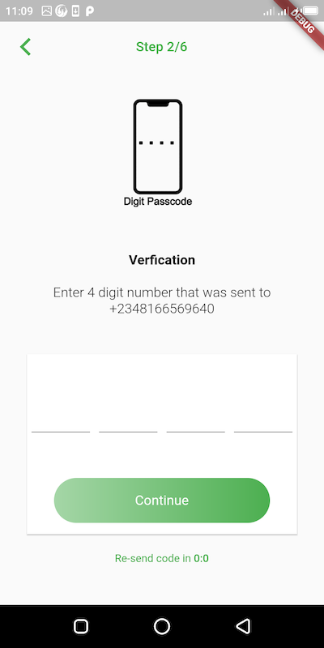
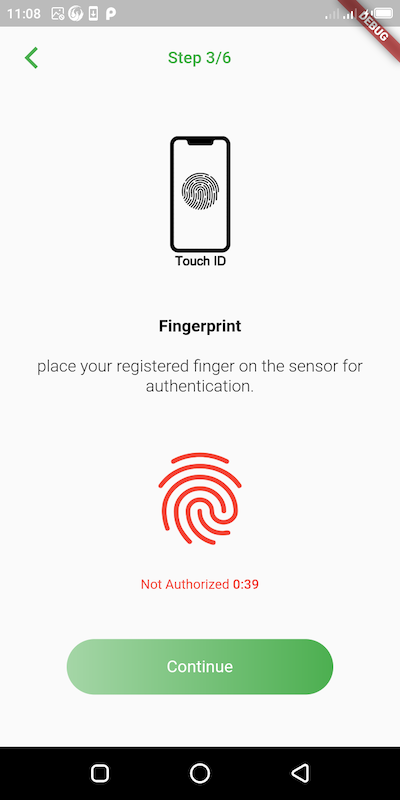

# flutter_authentication

A simple flutter application that demonstrates authentication with pin or OTP sent via sms and also Fingerprint.

## Getting Started

This project presents a simple UI layout to assist with the demonstration. Structured code to allow users understand the logic.

### Android
The permissions for android are compulsory and should be placed inside AndroidManifest.xml as shown below(excluding the brackets):

[ 
  <uses-permission android:name="android.permission.INTERNET"/>
    <uses-permission android:name="android.permission.USE_FINGERPRINT"/>
    <uses-permission android:name="android.permission.READ_SMS"/>
    <uses-permission android:name="android.permission.RECEIVE_SMS"/>
    ]
    
'FlutterFragmentActivity' is compulsory and should be factored inside MainActivty class as displayed in this project.

### IOS
Include the following (excluding the brackets) 
[ 	<key>NSFaceIDUsageDescription</key>
              <string>Why is my app authenticating using face id?</string>
]

inside ios/Runner/info.plist file

## Dependencies
- [pin_view](https://pub.dev/packages/pin_view)
- [local_auth](https://pub.dev/packages/local_auth)

## Design Inspiration
- [Dribble UI Template](https://dribbble.com/shots/5401676)

## Flutter UI Implementation

- [Lab: Write your first Flutter app](https://flutter.dev/docs/get-started/codelab)
- [Cookbook: Useful Flutter samples](https://flutter.dev/docs/cookbook)

For help getting started with Flutter, view our
[online documentation](https://flutter.dev/docs), which offers tutorials,
samples, guidance on mobile development, and a full API reference.
